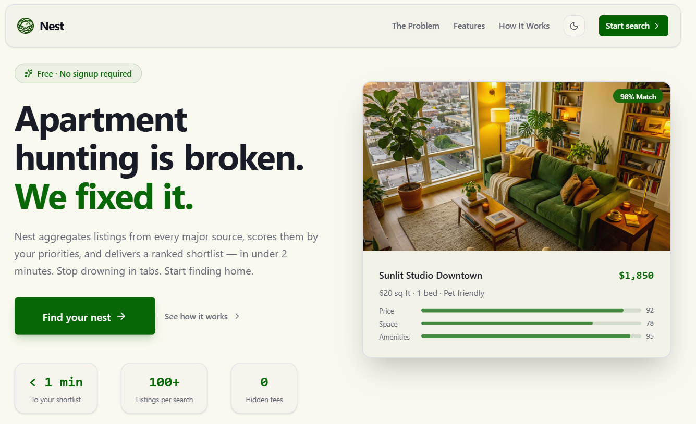

#  Nest

**Find a better apartment, faster—with less noise.**

---

## Why Nest exists

<table>
<tr>
<td valign="top" width="58%">

Renting should not mean refreshing five tabs, reconciling duplicate posts, and guessing which “great deal” is actually a fit. **Nest** is an apartment search product built for people who want clarity: one place to search, priorities you control, and ranked results that explain *why* a listing scored the way it did.

</td>
<td valign="middle" width="42%" align="center">



</td>
</tr>
</table>

**What you get**

- **Search tuned to you** — Say whether budget, space, amenities, or a balanced mix matters most; results reflect that instead of a generic sort order.
- **Less duplicate work** — Listings are merged from multiple sources and deduplicated so you are not deciding between the same ad twice.
- **Faster repeat searches** — Fresh listings from recent searches are reused when still valid, so follow-up queries stay snappy.
- **Transparency** — Scores and breakdowns help you see the tradeoffs, with links and images from the original sources when available.

Nest currently focuses on the **Toronto** rental market, with live listings from **Craigslist** and **Kijiji**.

---

## At a glance

| | |
|---|---|
| **Product** | Priority-based apartment search with scoring and multi-source aggregation |
| **Audience** | Renters who want ranked, explainable results instead of endless scrolling |
| **Differentiator** | Custom priorities, deduplication across sources, cached freshness, transparent scoring |

---

## Technical overview

**Architecture**

```
React Frontend → Spring Boot REST API → PostgreSQL

Search flow:
1. Frontend submits a search request
2. Backend asynchronously scrapes live sources
3. Backend pulls fresh non-expired cached listings from PostgreSQL
4. Listings are normalized, deduplicated, filtered, and scored
5. Frontend polls for results and renders ranked cards with score explanations
```

**Stack**

- **Backend:** Spring Boot 4.0.2 (Java 21)
- **Frontend:** React 19, TypeScript, Vite
- **Database:** PostgreSQL 16
- **Scraping:** Jsoup
- **Live sources:** Craigslist Toronto, Kijiji
- **Deployment:** Docker, Docker Compose, Kubernetes (DOKS)

**Features (implementation)**

- **Priority-based matching** — `BUDGET`, `SPACE`, `AMENITIES`, or `BALANCED`
- **Multi-source search** — Craigslist Toronto and Kijiji
- **Scoring** — 0–100 score from price, space, amenities, and lease flexibility
- **Listing cache** — Non-expired PostgreSQL rows reused for faster follow-up searches
- **Deduped results** — Live + cached listings merged and deduplicated before scoring
- **Images** — Real source images when available in the results UI
- **Containers** — Docker Compose for local development

---

## Quick start

### Prerequisites

- Java 21+
- Node.js 20+
- Docker & Docker Compose
- PostgreSQL (or use Docker Compose)

### Local development with Docker Compose

```bash
# Start all services in the background
docker compose up -d --build

# Check container status
docker compose ps

# Tail logs
docker compose logs -f api
docker compose logs -f frontend
docker compose logs -f postgres

# Stop everything
docker compose down
```

**Services**

- Frontend: `http://localhost`
- API: `http://localhost:8080`
- Health check: `http://localhost:8080/api/v1/health`
- PostgreSQL: `localhost:5432`

**Default local database credentials**

- Database: `nest`
- Username: `postgres`
- Password: `postgres`

**Useful reset**

```bash
# Rebuild the stack and recreate the Docker network
docker compose down
docker compose up -d --build
```

### Local development (manual)

**1. Start PostgreSQL**

```bash
docker run -d \
  --name nest-postgres \
  -e POSTGRES_DB=nest \
  -e POSTGRES_USER=postgres \
  -e POSTGRES_PASSWORD=postgres \
  -p 5432:5432 \
  postgres:16-alpine
```

**2. Run Spring Boot API**

```bash
# Build and run
./mvnw spring-boot:run

# Or with custom DB config
DB_HOST=localhost DB_PORT=5432 DB_NAME=nest DB_USER=postgres DB_PASSWORD=postgres ./mvnw spring-boot:run
```

**3. Run React frontend**

```bash
cd src/nestapp-frontend/nestapp
npm install
npm run dev
```

Navigate to `http://localhost:5173`

### Data sources and freshness

- **Live source 1:** Craigslist Toronto
- **Live source 2:** Kijiji
- **Fast path:** Recently stored PostgreSQL listings that have **not expired**
- Cached listings use an `expires_at` timestamp and are reused while still fresh
- Live and cached results are merged and deduplicated before scoring

---

## Scoring algorithm

### Score components (0–100 total)

- **Price score** (0–30 pts): Lower price is better  
  Formula: `(maxPrice - apartmentPrice) / (maxPrice - minPrice) * 30`

- **Space score** (0–30 pts): More square footage is better  
  Formula: `(apartmentSqft - minSqft) / (maxSqft - minSqft) * 30`

- **Amenities score** (0–20 pts):
  - In-unit laundry: 10 pts
  - Parking: 5 pts
  - Gym: 3 pts
  - Other amenities: 2 pts each (capped at 20)

- **Lease flexibility score** (0–20 pts):
  - Month-to-month: 20 pts
  - 6-month: 15 pts
  - 12-month: 10 pts
  - 12+ months: 5 pts

### Priority weight multipliers

| Priority   | Price | Space | Amenities | Lease |
|------------|-------|-------|-----------|-------|
| BUDGET     | 1.5x  | 0.8x  | 0.8x      | 0.9x  |
| SPACE      | 0.8x  | 1.5x  | 0.8x      | 0.9x  |
| AMENITIES  | 0.9x  | 0.9x  | 1.5x      | 0.9x  |
| BALANCED   | 1.0x  | 1.0x  | 1.0x      | 1.0x  |

---

## Kubernetes deployment

See [`k8s/README.md`](k8s/README.md) for deployment to DigitalOcean Kubernetes.

**Quick deploy:**

```bash
# Build and push images
docker build -t yourusername/nest-api:latest .
docker push yourusername/nest-api:latest

cd src/nestapp-frontend/nestapp
docker build -t yourusername/nest-frontend:latest .
docker push yourusername/nest-frontend:latest

# Deploy to K8s
kubectl apply -f k8s/namespace.yaml
kubectl apply -f k8s/postgres-deployment.yaml
kubectl apply -f k8s/api-deployment.yaml
kubectl apply -f k8s/frontend-deployment.yaml
```

---

## Project structure

```
nestapp/
├── src/
│   ├── main/java/com/nest/nestapp/
│   │   ├── controller/         # REST API controllers
│   │   ├── dto/                # Data Transfer Objects
│   │   ├── model/              # JPA entities
│   │   ├── repository/         # JPA repositories
│   │   └── service/            # Business logic
│   ├── main/resources/
│   │   ├── db/migration/       # Flyway SQL migrations
│   │   └── application.yml     # Spring Boot config
│   ├── nestapp-frontend/nestapp/
│   │   └── src/
│   │       ├── components/     # React components
│   │       └── App.tsx         # Main React app
│   └── test/                   # Unit & integration tests
├── k8s/                        # Kubernetes manifests
├── Dockerfile                  # Backend Docker image
├── docker-compose.yml          # Local dev environment
└── pom.xml                     # Maven dependencies
```

---

## Persistence notes

- Listings are stored in PostgreSQL after scraping
- Listings include source metadata, raw HTML, expiry timestamps, and image data when available
- Cached listings are reused for future searches while they are still fresh
- Apartment scores are stored per search so result polling is fast once scoring completes

---

## Contributing

1. Fork the repository
2. Create a feature branch
3. Follow CODESTYLE.md guidelines
4. Write tests for new features
5. Submit a pull request

---

## Contact

Built with care for anyone who has spent too long apartment hunting.

For questions or issues, please open a GitHub issue.
