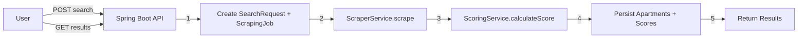
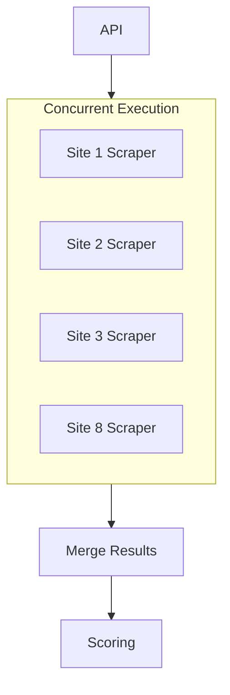

# Nest MVP Requirements Document

**Project:** Nest  
**Version:** 1.0  
**Purpose:** Focused requirements for the minimal viable product—core ingest flow with Spring Boot API, scraper service, and matching algorithm.

---

## 1. MVP Scope Definition

### In Scope

- **Core ingest flow:** Spring Boot receives search → calls scraper service → calls matching algorithm → returns results
- **Scraper service:** Fetches apartment listings from rental site(s), parses into structured data
- **Matching algorithm:** Scores apartments using PRD §3 logic, ranks by user priority
- **Simple frontend:** 3 pages only
  - Landing page (hero + value prop)
  - Form page (search criteria input)
  - Results page (ranked apartments with polling)

### Out of Scope for MVP

- SQS / message queue
- EKS worker pods / Kubernetes scaling
- API Gateway (rate limiting, JWT)
- Saved searches
- Email notifications
- Mobile app
- Distance-based filtering

---

## 2. Architecture (Simplified)

```
React Frontend → Spring Boot REST API → PostgreSQL
```

- **Single Spring Boot process:** REST API + scraper + scoring (no separate workers)
- **PostgreSQL:** Stores SearchRequest, ScrapingJob, Apartment, ApartmentScore
- **Frontend:** React + TypeScript, 3-page flow

---

## 3. Data Flow



---

## 4. Requirements Breakdown

| Area | Requirement | Source | Status |
|------|-------------|--------|--------|
| Ingest | Accept search criteria (priority, maxPrice, minSqft, amenities, maxLeaseMonths) | PRD §6 | Implemented |
| Scraper | Fetch listings from at least 1 site | PRD §2 | Skeleton only |
| Matching | Score apartments using PRD §3 algorithm | PRD §3 | Implemented |
| Orchestration | Job processor: scrape → score → persist | — | Out of scope for MVP |
| API | POST /search, GET /search/{id}/results | PRD §6 | Implemented |
| Frontend | Landing, form, results with polling | User | Implemented |

---

## 5. Matching Logic & Scoring Algorithm (from PRD)

### User Priority Selection

Users select ONE primary priority: **BUDGET**, **SPACE**, **AMENITIES**, or **BALANCED**

### Scoring Components (0–100 total)

- **Price (0–30):** `(maxPrice - apartmentPrice) / (maxPrice - minPrice) * 30`
- **Space (0–30):** `(apartmentSqft - minSqft) / (maxSqft - minSqft) * 30`
- **Amenities (0–20):** laundry 10, parking 5, gym 3, others 2 each (capped)
- **Lease (0–20):** month-to-month 20, 6mo 15, 12mo 10, 12+ 5

### Weight Multipliers

| Priority | Price | Space | Amenities | Lease |
|----------|-------|-------|-----------|-------|
| BUDGET   | 1.5x  | 0.8x  | 0.8x      | 0.9x  |
| SPACE    | 0.8x  | 1.5x  | 0.8x      | 0.9x  |
| AMENITIES| 0.9x  | 0.9x  | 1.5x      | 0.9x  |
| BALANCED | 1.0x  | 1.0x  | 1.0x      | 1.0x  |

**Output:** Top 20 apartments ranked by final score (0–100).

---

## 6. API Specification

**POST /api/v1/search**

- Request: `{ "priority": "BUDGET", "maxPrice": 2500, "minSqft": 800, "desiredAmenities": ["laundry", "parking"], "maxLeaseMonths": 12 }`
- Response (202): `{ "searchId": "uuid", "status": "PENDING", "pollingUrl": "/api/v1/search/{uuid}/results", "estimatedWaitSeconds": 120 }`

**GET /api/v1/search/{searchId}/results**

- 200 (ready): `{ "searchId": "uuid", "status": "COMPLETED", "totalApartmentsFound": N, "apartments": [...] }`
- 202 (processing): `{ "searchId": "uuid", "status": "PROCESSING", "estimatedWaitSeconds": 45 }`

---

## 7. Scraping Strategy (Up to 8 Sites, Under 2 Minutes)

### Problem

With up to 8 websites, sequential scraping would exceed 2 minutes:
- Per-site estimate: ~15–30 sec (search page + listing pages, 2s delay between requests)
- Sequential: 8 × 20 sec ≈ **2.5–4 minutes** — too slow

### Approach: Concurrent Scraping

**Run all 8 site scrapers in parallel.** Total time = time of the slowest site (~30–60 sec), not the sum.



### Implementation

| Aspect | Decision |
|--------|----------|
| **Across sites** | Concurrent (`CompletableFuture.allOf` or `ExecutorService` with 8 threads) |
| **Within a site** | Sequential (respect 2s delay between requests per domain) |
| **Timeout per site** | 30s max; skip site on timeout, continue with others |
| **Max sites** | 8 (configurable) |

### Java Pattern

```java
List<CompletableFuture<List<Apartment>>> futures = sites.stream()
    .map(site -> CompletableFuture.supplyAsync(() -> scrapeSite(site, searchRequest), executor))
    .toList();
List<Apartment> all = CompletableFuture.allOf(futures.toArray(CompletableFuture[]::new))
    .thenApply(v -> futures.stream().flatMap(f -> f.join().stream()).toList())
    .join();
```

### Constraints (from PRD)

- 2-second delay between requests **per domain**
- 30s timeout per page
- Rotate User-Agent headers
- Respect robots.txt

---

## 8. Open Questions / Unresolved Sections

Decisions needed before or during implementation (scraping strategy is now defined in §7):

| Topic | Options | Notes |
|-------|---------|-------|
| **Job execution** | Sync (user waits) vs async with polling | Concurrent scraping keeps sync flow under 2 min |
| **Data sources** | Up to 8 sites; which ones first | Craigslist, Zillow, Apartments.com, etc. |
| **minPrice / maxSqft** | Add to API vs derive from scraped data vs use defaults | ScoringService expects both; SearchRequest has only maxPrice, minSqft |
| **Deployment** | Local / Docker Compose only vs cloud (AWS/DO) | MVP may stay local |
| **Auth** | None vs minimal API key | PRD has JWT via API Gateway; out of MVP scope |

---

## 9. Implementation Checklist

- [ ] Implement job processor (orchestrate scraper + scorer within API)
- [ ] Implement real scraper with **concurrent** multi-site support (up to 8 sites, under 2 min)
- [ ] Resolve minPrice / maxSqft for scoring (API, derived, or defaults)
- [ ] Wire frontend form → API → results (verify polling works)
- [ ] Docker Compose for local dev

---

## 10. Success Criteria (MVP)

- End-to-end flow works (form → scrape → score → results)
- 10–30+ apartments scraped and ranked per search
- Results returned within 2 minutes (concurrent scraping)
- No hardcoded credentials
